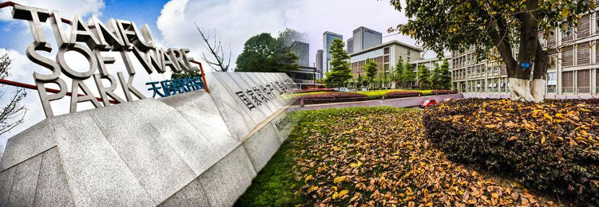
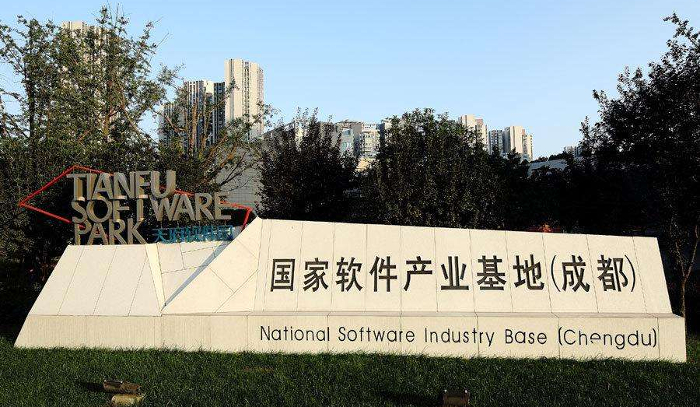

> 本文是2017年所写三篇财经类评论文章的**初篇**，最早发表在知乎上，截至目前已经获得近20万次点击，以及812位同学的关注。

成都市南门2016年8月开启的的这一波房价上涨，确实出乎大家意料，打乱了不少同学的置业计划。写这篇文章是希望另辟蹊径，从成都市的产业结构、收入水平2个纬度入手，理性探讨当前成都房价背后值得IT从业者思索的问题。

本次房价大幅度上涨，从年初看房的经验来看，先是从天府*一、二、三、四、五*街兴起，然后经由开发商和中介的放大与炒作，结合自贸、政务中心南移等利好消息，而逐渐蔓延至整个南延线，从而引爆恐慌情绪，造成刚需、改需提前一拥而上，最终引发当前踩踏式入市的局面。

首先，笔者认为，天府*一、二、三、四、五*街房价过去2年确实被低估，从周边的综合配套、区域定位的角度而言，合理上调属于正常市场反应。截止2016年5月底的时候，整个地块的新盘基本全部出清(存量较少)，当时整体均价较为合理，`总价`、`月供`、`利率`各方面都比较理想。

其次，成都市南门CBD周边的企业以IT行业为主，而**成都IT企业大部分属于外向型，即本地大型企业不多，主要吸引国外、省外企业来蓉设立分支机构或研发中心**，这一点大部分知友应当有所了解。产业先寥寥几句讲到这里，暂且按书不谈，接下来从企业的角度继续走起。

<!-- more -->

国/省外企业来蓉投资，主要倚重成都的人力资源在质量、成本两方面的优势。在2015年之前，成都市人力资源成本总体是比较合理的，人力资源市场供求、薪酬两方面都较为合理。但是从2015年伊始，资本开始大量炒作O2O、手游、VR、AI等概念，无数拿到风险投资的创业型企业疯狂烧钱，造成用人成本极速攀升，1至2年工作经验的同学，税前月薪即已炒至8-12K左右(*2015年之前一位外企5年senior级别工程师的价格不过如此*)。最终，O2O沦为昙花一现的泡沫；2016年末尾O2O、手游、VR开启行业洗牌模式，80%以上的初创企业因为资金链断裂轰然倒下，IT行业薪酬整体呈现一定幅度的下调。恰似2015年A股5千点自由落体至3千点，最后以一波股灾尘埃落定。资本市场那些年发生的事情，与当下流动性助推下的楼市，情形何其相似。

截止到2016底来看，软件园整体收入，在保证朝九晚六周末不加班的前提下，工作3-5年左右的同学税前月薪平均在8-12k范围，刨除所得税，7-10k左右的纯收入在软件园应是常态，考虑到技术人员10年左右的职业寿命周期，这个数目其实算不上高收入职业。只能说在经济全面下行的当下，还算一份相对稳定的职业。

大致介绍完产业、企业、收入3个方面之后，让笔者来开启惊心动魄的一段。按照上述收入水平，目前天府软件园周边70年产权住宅均价炒作至15k，即一套100平左右的小套三或者大套二总价共需一百五十万，即使卖掉两套三四线城市的老房凑足50万首付，然后按照基准利率商业贷款100万，那么20年期等额本息月还款在6500元左右，30年期还款在5500元左右。按成都市工薪家庭实际月收入13k计算(税后，且园区妹纸的收入普遍不高，4-6k基本是常态)，每月房贷扣除完毕，家庭日常开支仅剩下7000元左右(包含小孩的奶粉、教育投入，以及养车成本)，但是月供周期有30年，**IT行业技术人员的职业周期一般而言约在10-15年左右，漫长房贷还款周期当中，剩下的一多半时间能否干得动，或者继续保持当前的收入水平，这个是一定值得打个问号的**。所以，成都楼市暴涨至今，很难说在背后是有理性需求在做支撑的。

有同学可能会认为，社会整体薪资水平会如同往年那样，伴随通货的膨胀而同步增长。但老僧常谈的话题是，当前宏观经济环境与2008年那次货币宽松有着明显本质的不同，当时GDP增速保持在7以上，各行各业都在加大产能，加之流动性充沛，遍地皆是赚钱效应。但是2016年之后，中国经济逐步探底，GDP增速降至6附近。前期货币不断宽松带来人力成本的逐步叠加，导致当前低端产品出口竞争力下降。加之产业转型升级不及预期，中国制造业目前之现状就是**低端产品产能过剩、高端产品又做不出来，两难**。更何况，经济增速的探底依然还在持续，接下来大家面临的是**通胀**还是**滞胀**，也是值得打个问号的问题。所以，接下来重点谈一谈成都南门CBD里的企业和小白领们的收入。

近年来，伴随成都市大力度的招商引资，陆续从一线城市迁移来一些企业，部分技术人员和高级管理人员也随迁过来，但主要是transfer数量有限的老(骨)员(干)工，薪资水平在15-20k左右(也是依靠一线城市高强度的劳动换来的，如果愿意玩命加班，成都也可以拿到这数，但代价是健康以及陪伴家人的时间)，这部份同学在软件园，应该是具备完全支付能力的刚需，但是伴随这些年的逐步消化，以及企业入驻速度的逐年下降，这部分payable的增量其实有限。换而言之，这一波房价窜涨，在整体收入水平不出现大幅上涨的情况下，后续很难持续性的接盘下去，特别是在当下实体企业举步维艰，IT热点泡沫逐个破裂的时间段。如果投资客看好城南的不动产，是因为软件园CBD的小白领们手里那点银子能够接盘，那么笔者作为在IT企业执业近8年的资深工程师，亦然觉得刨去家庭开支承受起来压力较大。广义一点来讲，对于园区里工作年限较短的大部分同学，当前价格显得更加困难。

媒体每谈及成都房价，总要被拉出来和一线城市做个比较。但一线城市房价格畸高，缘于一线城市住宅已经偏离居住需求，逐步演变为资产配置工具。凭心而论，成都目前不具备一线城市的稀缺资源(北京感人的高考分数线以及政治中心地位、上海的港口和金融、深圳完备的电子产业链)。整体而言，成都的产业结构还处于普通二线城市水平，在装备制造、规模化轻工业、高端化工方面与杭州、苏州、无锡等地处沿海的出口外向型城市存在着差距，况且这些沿海城市有着中国改革开放30多年的财富积累，其房价有着巨大的民间资本作为支撑，击鼓穿花还能够得以继续。

综合来看，成都南门CBD里的IT企业们，无论国外还是省外，都是倚重于成都较低的人力成本、优惠政策、政府性产业基金补贴才西迁过来。但是绝大多数产业层次低端且外包氛围浓厚，特别是外资企业，大部份属于较低端的maintanence职位，利润有限且行业粘着度不高，更遑论助推产业升级。但重点在于，如果继续任由房价和互联网泡沫继续推动人力成本走高，那么外企们的迁离将会是越来越大概率的事件，而成都自身的产业结构还不能承接下外企迁移后的职位空缺，表面看这是国际分工的问题，背后实质依然是深层次的产业结构性的问题。

最近，正好和园区几位HR朋友聊到人力成本方面的话题。实质上，当下成都IT行业的人力成本，一线工程师的整体薪资水平正在逐渐向北上深接轨，外资和部分外省企业已经颇感压力。拿到投资的创业公司情况可能稍好，但是在自身缺乏造血能力的背景下，如果无法顺利融得下一轮资金，也就不得不面对研发团队解体的窘境。在整体就业不稳定、实体经济愈发萎靡、行业热点泡沫逐个破灭的宏观环境下，高杠杆投资房产的风险到底有几何，这个更是值得大家认真掂量的问题。

> 洋洋洒洒写了这么多，答主认为当前成都这波房价串涨，主要是由天府一、二、三、四、五街房源价格补涨所带动，结合超低利率折扣以及流动性宽松的背景，经由中介和部分开发商的放大炒作，加之自贸区、省政府南移等利好消息，共同推动刚需和有改善意向的消费者，恐慌性提前入市的结果。

可预计，自2016年成都市颁布史上最严格限购政策之后，伴随房贷定向加息的影响，2017年上半年会迎接来最后一波高峰，后续增长(能够持续性接盘)将会乏力，楼市逐步降温，并进入漫长的高位盘整阶段。部分偏离基本面涨幅较大的区域，在市场趋于理性之后，将会面临房价的阶段性回调。

目前，通过行政性限购抑制房价上涨冲动，挤压资金进入实体经济的效果还有待观察。但就中央经济工作会议中首次提出的*“房子是用来住，不是用来炒”*，以及十三五规划所体现的《筑牢实体经济之基》的提法而言，通过房地产税扩围试点、租售同权等方式，逐步卸除房地产投资属性应是接下来即将发生的大概率事件。

IT企业大部分都属于轻资产公司，国/省外企业冲着性价比较高的人力成本而来，如果任由人力成本继续高涨，向更低成本区域的转移就会被提上企业们的议事日程。所以，**现在的繁华热闹并不能掩盖行业背后所存在的结构性问题。大而不强，外包业务层次低端，城市和业务粘着度较弱，就是当前成都IT的真实写照。因此答主略有疑虑的认为，企业去留和房价高低，恐怕是个并不能够两全其美的跷跷板问题。**

如果房价暴涨带动人力成本继续走高，那么企业over。如果人力成本不涨，高额的房价无人接盘，楼市over，地方财政over，各种企业的优惠政策和补贴over，然而部分企业最终还是要over。成都南门高新区的码农如果终日醉心房价，为一尺蜗居而集体焦虑，国家的产业转型也基本over。日本楼市硬着陆，整体经济看似痛苦，但是川崎，安川这些业内一流企业都是在那个时候逐步发展起来的，老百姓不浮躁，不惦记国庆节去南门高新区扫楼，大家坐下来踏踏实实把产品搞好，参与到国际市场竞争，赚回真金白银的外汇，私以为硬着陆让各行各业按照市场规律重新洗牌又有何不可？

下图为全国主要二三线城市工薪阶层收入情况，2016-2017年成都市的**人均薪酬水平**甚至没有赶上同处西南的贵阳、重庆两市。

下图为2016年全国27个省会城市的**GDP总量**以及**人均GDP**，虽然GDP总量早已破万亿大关，但是成都市坐拥**1400万**常住人口，因此**人均GDP**只位于全国中下游水平，远远落后于**武汉**、**杭州**、**南京**、**长沙**等人均GDP高达6位数的中东部城市，也落后于**郑州**、**合肥**等新兴二线城市。仅与**长春**、**银川**相当，略高于**贵阳**与**西安**。

从上面两张图表的对比可以看出，当前成都市的`人均GDP`、`人均薪酬水平`2项指标皆排在全国中游，但房价涨幅已经直追中东部苏州、南京等城市，截至2017年8月文章第3次修改为止，成都整体房价水平已经与合肥相当。但值得进一步深思的问题在于，房价带动人力成本上行之后，在**交通与物流成本**高于中东部二线城市的现实背景下，成都招商引资的吸引力，恐怕并非简单的城市形象营销所能解决的。高房价的成都与产业的成都，现阶段依然是一个两难命题。

凭心而论，这波房价就如同黄金周驾驶私家车出行，大家都去赶同样的时间节点，而新修的马路又未能及时通车，车流滚滚必然造成拥堵。如果错峰出行，其实不会存在这样的问题。对于楼市其实是同样的道理，买房需求的总和其实是一个恒定不变的常量(二胎新生的需求作为变量，可能要到20年之后才得以体现)，如果大家在恐慌心理的作用下，都去挤这一波房价的未班车，而忽略在特殊经济周期中背后可能存在的杠杆风险，那么短时间内争先恐后恐慌性入市的结果，就是催生出楼市和土地市场的更高溢价，结局便是如此。

从更宏观的层面来讲，这波楼市在政策层面，最早的出发点只是去库存，南边的麓山、华府版块，都是当年库存量较大的区域，自然也是这次出货的重点。过去开发商拿地杠杆较高，牵连着银行，牵连着地方政府出于基础设施建设投资需要，而委托城投平台抵押给银行的土地。房价跌、地价跌、地方政府和国企的债务风险就会凸显。所以时至今日，这场去库存运动演变为了**通过个人加杠杆，让地方政府、国有企业债务减杠杆**的运动，这就是这波房价串涨全部问题的本质。

> 目前城南热炒的自贸区、省政务中心搬迁的消息，普通草民无从去判断真假。麓山和华府板块目前的各项规划还停留在图纸上，最后呈现的效果和市政公共服务的配比，最终可能是笔糊涂账。遥想起几年前，中和热炒领馆区概念，传言南二环倪家桥的外国领事馆要搬迁过来，不过时至今日，一座叫领馆区1号的住宅是拔地而起，而说好的外国领事馆却不见了踪影，前车之鉴后事之师。

> 对于部分知友回复中提到的南京楼市(二线城市房价4小龙之一)，地处长江三角洲核心地带，苏锡常(苏州、无锡、常州，都是化工 、装备制造业重镇)所在的江苏省会，改革开放后积累的民间资本充裕，人均薪酬也在成都之上，动车1个小时直达上海，房价合理与否答主并不清楚，江苏人民应当自有论断吧。

最后，谈一下最近被提得最多的合肥房价的问题，合肥是中部城市，桥接武汉和长三角城市群，目前合肥主城区一手房均价在15k左右，最近几年合肥的半导体IC产业发展十分迅速，凭借良好的地理位置和沿江高铁，从东部沿海城市承接了大量的工业制造业。合肥、武汉都属于沿江中部城市，工业制成品向外运输的成本较低，成都三不沿的现实地理位置，无法在物流成本方面与沿江沿海城市相提并论，因此成都的长期发展还是需要维持相对较低的人力成本，从而弥补物流成本上的短板。

**概而言之，房价作为影响人力成本的决定性因素，成都不应在这方面向中东部沿海城市看齐。如果放任房价短期内暴涨，必然会对成都的招商引资、人才吸引造成长远的影响。**

> 硬币的一面是产业成功转型的日韩，另一面则是日渐走向产业空心化的香港。而居民部门的杠杆再度提高的余地已经很小，依靠投资拉动经济发展的边际效用正在逐步递减，作为怀揣强国梦想的本届班子，脱实向虚或即将止于当下，而金融整顿与改革的大幕已经徐徐拉开。更进一步的分析与观点，请参见笔者系列文章的番外篇[《2017年6月，再聊聊成都房价、地价那些事》](https://uinika.github.io/2017/08/27/article/2017/chengdu-real-estate-2/)。

