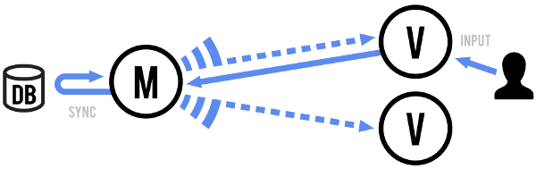
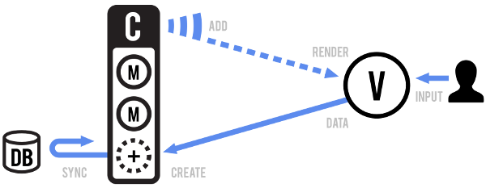

伴随着W3C协议规范不断更新，以及现代化浏览器技术的不断进步，Web前端技术在整体取得日新月异发展的同时，也推动着页面UI/UE与交互逻辑的迅速膨胀。开发人员函需从大量底层处理的劳动中解脱出来，更加从容的去面对纷繁复杂的单页面交互需求。本文开头会先简单的梳理一下历史，然后基于现代化前端框架的主要特性，逐一对Backbone进行比较和剖析。


从前端技术发展趋势的角度而言，目前层出不穷的现代化前端框架的诞生，都可以认为是Angular和Backbone等古典前端框架设计思想走向融合之后的产物。虽然截至到本文开始执笔的时间，Backbone已经略微**old school**，但之所以单独对Backbone着重笔墨，主要是在**组件化**和**作用域控制**等方面，Backbone更加接近于现代化前端框架的设计理念，而这两点又正好是同一时期的Angular并没有解决好的问题。

<!-- more -->

起步于2005年的[jQuery](http://jquery.com/)仅仅对DOM操作进行了基础性的封装，提供了可链式调用的写法、更加友好的ajax函数、屏蔽了浏览器兼容性的丰富选择器，但是并没有解决前端开发中选择器滥用、作用域相互污染、代码复用度低冗余度高、数据和事件绑定烦琐等等痛点。

为此，2009年横空出世的[Angular](https://angularjs.org/)提供了一揽子解决方案，对浏览器原生事件机制进行深度封装的同时，提供了路由、双向绑定、指令等现代化前端框架的特性，但是也正是由于其封装的抽象程度太深，学习曲线相对陡峭，而对于`controller`和`$scope`的过度倚重，以及照搬Java的MVC分层思想试图通过`service`来完成页面逻辑的复用，并未彻底解决前端开发前面提到的诸多痛点。

诞生于2010的[Backbone](http://backbonejs.org/)则另辟蹊径，通过与[Undersocre](http://underscorejs.org/)、[Require](http://requirejs.org/)、[Handlebar](http://handlebarsjs.com/)的整合，为那个年代的开发人员提供了Angular之外，一个更加轻量和友好的前端开发解决方案，许多思想对于后续的现代化前端框架的发展起到了举足轻重的作用。




## 视图组件化

**视图组件化**是Vue、React、Angular2等现代化前端框架的基本思想，其主要目的是将复杂的DOM结构切割为更小粒度的HTML代码片段。Backbone通过`Backbone.View.extend()`继承函数来新建一个视图对象（*即组件*），该视图对象即可以使用`el`属性挂载到现有DOM，也可以通过`template`属性建立全新的视图对象。对Vue2比较熟悉的同学，应该会感觉到这样的写法与*Vue组件对象*非常相似。事实上Backbone视图对象不旦与Vue2，也与Angular2和React当中的**组件对象**作用极其类似，具体请参考下面的代码：

```javascript
/* Backbone视图对象 */
Backbone.View.extend({
  id: "app",

  template: '...',

  events: {
    "click .icon":          "open",
    "click .button.edit":   "openEditDialog",
    "click .button.delete": "destroy"
  },

  initialize: function() {
    this.listenTo(this.model, "change", this.render);
  },

  render: function() {
    this.$el.html(this.template());
    return this;
  }

});
```

```javascript
/* Vue组件对象 */
import Vue from 'vue';

new Vue({
  template: '<div>模板字符串<div>',

  data: {
    // 组件绑定的数据
  },
 
  methods: {
    myEvent() {
      // 组件自定义事件
    },
  },

});
```

```jsx
/* React组件对象 */
import React from 'react';
import ReactDOM from 'react-dom';

class MyComponent extends React.Component {
  constructor(props) {
    // 组件构造函数
  }

  myEvent(event) {
    event.preventDefault();
  }

  render() {
    return (
      // JSX
    );
  }
};
```

```typescript
/* Angular2组件对象 */
import { Component, Input } from '@angular/core';
import { Demo } from './demo';

@Component({
  selector: 'demo-detail',
  template: `
    <div>模板字符串</div>
  `
})
export class DemoDetailComponent {
  @Input() demo: Demo;
}
```

## 作用域控制

通过上面代码的比较，大家应该能够了解，Backbone视图对象的核心任务在于**DOM选择器、数据事件绑定的作用域控制**。Web前端组件化的过程，实质是可以认为是一个切割DOM的过程，切割DOM必然意味同时需要分离**事件**和**绑定数据**，并且控制视图对象上选择器的作用范围。

首先，Backbone的事件绑定机制源于JQuery的事件委托方法`on()`，Backbone仅仅将其封装成为一个简单明了的糖衣语法对象，集中注册当前视图对象上涉及的DOM事件，以及事件触发的选择器和事件类型。

```javascript
var View = Backbone.View.extend({
  id: "login",
  template: Handlebars.compile(Html),
  initialize: function () {},
  events: {
    "input": "checked",
    "click .btn": "login"
  },
  render: function () {
    this.$el.html(this.template());
    this.$(".rember-me").iCheck({
      checkboxClass: "icheckbox_square-blue",
      radioClass: "iradio_square-blue"
    });
    return this;
  },
  login: function () {
    var login = new Model();
    login.auth();
  }
});

return View;
```

其次，从DOM选择器的角度，上面Backbone对象当中所有需要对于DOM进行的操作，都封装到`this.$el()`或者`this.$()`函数上进行，核心目的就是为了控制JQuery选择器的作用域，防止选择器的互相污染，并提升选择器的效率。

## 数据绑定

Backbone原生的数据绑定需要依赖于underscore当中的`<%=...%>`表达式，但鉴于underscore模板表达式在书写循环语句时语法过于繁杂，因此在实际生产环境下，笔者采用了Handlebars模板引擎进行数据绑定，通过执行`template: Handlebars.compile(Html)`编译字符串模板，提供与Angular以及Vue当中Mustache表达式类似的开发体验。因为字符串模板编译后通过`this.$el.html(this.template())`插入当前视图对象，因此也就实质上完成了上面内容所提到的**数据绑定的作用域控制**。

```html
{{#each comments}}
  <h1>{{title}}</h1>
  <p>{{content}}</p>
{{/each}}
```

## MVVM与双向绑定

**MVVM**是*Model-View-ViewModel*的缩写形式，相比传统**MVC**模式的*Model-View-Controller*，最主要的区别在于将模型Model与视图View的绑定工作从控制器**Controller**，前置到视图模型对象**ViewModel**当中。**MVVM**这一概念最先由Angular1.x在Web前端开发当中提出，但是事实上Angular1.x仍然保留了Controller的存在，并严重依赖于其间接绑定`$scope`（*可以理解为Angular中的ViewModel*），这也正是笔者认为Angular1.x设计上的一个缺陷所在，一方面Controller的存在会让组件化工作进行得极其困难，另一方面为了抽象复用的业务逻辑，Angular不得不专门抽象出对应于Controller的Service服务层，而Web前端实际开发过程当中，大量的业务复用是基于DOM结构存在的，横向抽象出的Service层作用显得比较鸡肋，这也正是为什么虽然Angular提供了比Backbone更加完整的单页面应用开发体验，但笔者依然并未将其视为现代化前端开发当中组件化思想来源的原因所在。


视图模型对象**ViewModel**存在的意义，主要是为了更加清晰的进行**View->Model->View**数据绑定，Angular1.x默认对Mustache表达式执行双向绑定（*View和Model的数据双向映射，无需事先声明*），Vue2采用了单向绑定（*数据必须先在ViewModel中进行声明*）响应式数据更新（*View和Model都基于ViewModel中事先声明的数据进行映射*）。而Backbone和Handlebars默认是单向进行绑定，如果需要实现**View**和**Model**的双向数据映射，必须通过手动监听`Backbone.Model`对象上的`change`事件，并且在事件触发后立刻执行该视图对象上的`render()`渲染函数。

```javascript
var Model = Backbone.Model.extend({
  default: {
    cases: {}
  },
  initialize: function () {
    this.getCaseList();
  },
  getCaseList: function () {
    var self = this;
    Http.fetch({
        url: "/legal/verdict",
        method: "GET"
      })
      .then(function (data) {
        if (Http.verify(data, 200)) {
          self.set(data);
        }
      })
  }
});

var View = Backbone.View.extend({
  id: "demo",
  model: new Model(),
  initialize: function () {
    this.listenTo(this.model, 'change', this.render);
  },
  template: Handlebars.compile(Html),
  events: {},
  render: function () {
    this.$el.html(this.template(this.model.attributes));
    return this;
  }
});

return View;
```

上面代码中，首先设置视图对象的`model`属性，通过`new Model()`实例化当前代码内所继承的`Backbone.Model`对象。然后在当前视图对象的初始化函数`initialize`当中，通过Backbone视图对象上内置的`listenTo(this.model, 'change', this.render)`方法完成对模型的监听，并设置相应的回调渲染函数。从API使用的角度而言，**Backbone缺乏一个真实的ViewModel概念**，但是实际生产环境下，可以考虑将该视图对象所涉及的多个数据对象集中放置在一个`Model`内部处理，从而最大程度上模拟ViewModel作为视图和模型之间数据绑定介质的作用，虽然这样的灵活处理方式显得并不优雅。

## 前端路由

Web应用程序通常需要提供可链接的、可书签化的、可任意进行分享的URL地址，从而去标识应用程序的各个具体状态。现代化前端框架的Router实现（*例如：`vue-router`、`react-router`*），通常会提供**#Hash**或者**HTML5**两种前端路由方式，Backbone的路由机制`Backbone.Router`是基于路径Hash进行实现。`Backbone.Router`当中，大量封装了`window.history`和`window.location`中提供的大量API，将浏览器地址栏当中的URL属性，与Backbone路由事件相绑定，当访问这些URL属性时，相应的路由事件就会被触发。


路由事件当中，通常会初始化Backbone视图对象上的`render()`函数，然后调用其`$el`属性将渲染后的Backbone视图对象转换为JQuery对象，并通过`$.html()`将其插入到应用程序的DOM挂载点，从而将URL状态的变化绑定到页面状态的局部刷新。

```javascript
var Router = Backbone.Router.extend({
  initialize: function () {
    this.app = $("#app");
  },
  routes: {
    '': "login",                   // default
    "login": "login",              // #login
    "dashboard": "dashboard",      // #dashboard
  },
  login: function () {
    var loginView = new Login;
    this.app.html(loginView.render().$el);
  },
  layout: function () {
    this.layoutView = new Layout;
    return this.app.html(this.layoutView.$el);
  },
  // dashboard是嵌套视图
  dashboard: function () {
    var dashboardView = new Dashboard;
    this.layout().find("#main").html(dashboardView.render().$el);
  },
});

return Router;
```

对比上面的代码，大家应该能够发现`vue-router`和`react-router`这两款现代化前端框架的路由实现，与Angular1.x上的`ui-router`最大的区别在于：前者的路由目标是组件Components，而后者的路由则是绑定在控制器Controller。而Backbone路由机制的设计，虽然配置和编写方式略显老派，但是其`URL->路由事件->视图对象->局部HTML片断`的渲染思想，明显相比Angular粒度更小，也更接近现代化前端框架的**组件化路由机制**。

> 2017年以后的Angular1.6.x版本增加了`ngComponentRouter`模块，已经原生提供了Component Router支持。

## 模型与集合分离的缺陷

Backbone当中的**Collection**用于存放**Model**，这样的设计主要是出于2个角度的考虑，第1是方便Backbone扩展Underscore提供的集合操作方法，第2是方便通过Backbone封装的`fetch()`抓取服务器端的数组类型数据。



创建*Collection*需要首先创建*Model*，然后将该*Model*赋值给`Backbone.Collection`继承对象的`model`属性，最后在实例化*Collection*时通过构造函数传入每个具体的*Model*。因此，Backbone当中*Collection*和*Model*的关系实质类似于**数组**与**对象**的关系，Backbone只是将这两种引用数据类型分开进行处理，便于分别使用Underscore上提供的辅助函数处理对应的数据类型。

```javascript
var user = Backbone.Model.extend({
  defaults: {
    name: '',
    age: 0
  }
});

var group = Backbone.Collection.extend({
  model: user
});

var myGroup = new group([
  {
    name: 'hank',
    age: 32
  }, {
    name: 'uinika',
    age: 23
  }
]);
```

`Collection`与`Model`分离的设计方式，在服务器后端接口需要变化或者调整的时候，总是需要去更改相应的数据类型及关联操作，这样对于前端开发人员敏捷的响应需求变化是非常不利的。这样的设计方式，在Java开源MVC框架大行其道的年代，多少是受到服务器后端**对象-关系映射**理念的影响，笔者认为这是Backbone处理比较欠妥的一个的地方；虽然站在**MVVM**里`ViewModel`的角度有其合理性，但是实现起来还是相对冗杂了一些。因此，笔者在Backbone的使用实践当中，最终摒弃了`Collection`的使用，而完全通过Model或者Model上的数组属性来接收服务器端的响应，并且在项目中通过下划线`_`引用全局的underscore操作各类数据，避免与Backbone数据对象的类型发生耦合。

## 僵尸视图问题

总体而言，Backbone是一款**事件驱动**的前端框架，在Backbone应用程序中会大量使用到事件机制进行各类交互，常见的用途主要体现在如下3个场景。

1. 通过`Backbone.View`的`events`属性绑定事件到视图的DOM元素。
2. 为`Collection`和`Model`绑定`change`事件，然后在事件触发时调用`render()`进行页面重绘。
3. 应用程序的各块业务逻辑都通过`Backbone.Events`提供的事件机制进行驱动的场景。

在开发单页面应用程序的场景下，当视图对象伴随URL路由地址不断进行局部刷新的时候，由于大量事件并未伴随视图对象的移除而同时解除绑定，造成大量事件对象堆积在浏览器内存当中，逐渐让视图对象成为僵尸视图，最终引发内存溢出的惨剧（*更加详细的讨论可以参见[Zombies! RUN! (Managing Page Transitions In Backbone Apps)](https://lostechies.com/derickbailey/2011/09/15/zombies-run-managing-page-transitions-in-backbone-apps/)一文*）。

早期的Backbone版本并没有提供僵尸视图的解决办法，直到Backbone1.2.x版本之后，开始在`Backbone.View`视图对象上新增加一个`remove()`函数支持，可以在移除视图对象DOM元素的同时，自动调用`stopListening`移除之前通过`listenTo`绑定到视图上的Backbone自定义事件，但是`remove()`并没有同时移除视图上绑定的JQuery DOM事件，所以还需要再手动进行清理。加上`Backbone.Router`的API设计过于简单，也没有提供相应的路由切换回调函数去自动调取`remove()`卸载事件，因此截止到目前最新的Backbone1.3.3版本，依然未能彻底在官方实现上解决僵尸视图的问题。

> 解决僵尸视图的关键，是需要在恰当的位置提供一种通用的事件**卸载**机制，而Backbone视图的切换多与路由URL的状态变化相关，因此路由事件成为解决Backbone僵尸视图问题的关键点所在。


## 构建单页面应用

Backbone出现的年代，Web单页面应用开发方式还未能普及，基于JSP或PHP等服务器标签的前后端耦合式开发还是主流，因此Backbone对构建单页面应用的支持还较为薄弱，也造成**嵌套视图**和**僵尸视图**两大问题长期困扰着继往开来的Backbone开发人员们。伴随移动互联网的快速崛起，对单页面应用交互的需求量越来越大，大量开发人员在实际开发实践过程中，逐步对`Backbone.Router`进行增强，其间诞生了[backbone.routefilter](https://github.com/boazsender/backbone.routefilter)和[backbone.subroute](https://github.com/BackboneSubroute/backbone.subroute)两款优秀的第3方Backbone路由插件，基本解决了**僵尸视图**卸载的痛点。但是，伴随Web前端的交互逻辑越来越复杂，**嵌套视图**的问题又逐步开始凸显，而**嵌套视图**依然与**路由机制**密切相关。因此，[marionette](http://marionettejs.com/)和[thorax](https://github.com/walmartlabs/thorax)两款基于Backbone的单页面前端框架应运而生。

marionette

thorax

## 基于RequireJS模块化

在开发人员还不能使用ES6的`import`和`export`语句愉快的进行模块化的年代，RequireJS几乎成为前端模块化的必然选择，通过为`define()`方法添加相应的依赖和回调函数，实现JavaScript代码的模块化，随后诞生的Angular1.x通过`angular.module`提供了类似的模块化特性，但是只能异步的加载HTML模板，并不能异步加载JavaScript脚本，使用上略有局限，虽然也有开发人员提出整合Angular1.x和RequireJS来弥补该局限，但是两种模块化机制混用又会为项目带来新的复杂度。

RequireJS遵循了AMD规范，提供`require()`方法加载依赖然后执行相应回调函数，以及`define()`方法去定义AMD模块。

```javascript
require([
    /*----- core -----*/
    "backbone", "admin", "router", "backbone.marionette",
    /*----- general -----*/
    "http", "util",
    /*----- plugin -----*/
    "bootstrap", "jquery.slimScroll", "jquery.webcam"
  ],
  function (Backbone, Admin, Router) {
    var router = new Router();
    Backbone.history.start();
    // backbone debugger
    if (window.__backboneAgent) {
      window.__backboneAgent.handleBackbone(Backbone);
    }
  }
);
```

结合`require.text`插件，异步加载远程的HTML模板，避免类似Angular1.x虽然能定义模块，但却无法异步进行加载的尴尬。

```javascript
define([
    "backbone",
    "handlebars",
    "admin",
    "text!snippets/layout/view.html"
  ],
  function (Backbone, Handlebars, Admin, Html) {
    return Backbone.View.extend({
      id: "layout",
      initialize: function () {
        this.render();
      },
      template: Handlebars.compile(Html),
      events: {

      },
      render: function () {
        this.$el.html(this.template());
        return this;
      }
    });
  }
);
```

虽然RequireJS本身可以异步按需加载各种依赖，但是受限于`Backbone.Router`实例化时会一次性加载所有视图对象，导致整个应用程序会在启动时一次性加载所有依赖，产品层面并没有体现出前端模块化之后的优势，仅仅有利于项目源代码的管理。但是通过**Backbone**+**RequireJS**的组合来实现`.css`、`.js`、`.html`的完全异步加载，确实为后续现代化前端框架的发展提供了比较良好的示范。

> Webpack2.x.x已经原生支持ES6的`import`语句，且增加了`import()`代码切割（*code split*）函数，应该是目前最方便好用的前端模块化暨打包工具。

## 完整Demo

Backbone这套前端自动化项目依然基于Gulp工作流构建，编译时会对每个模块进行代码混淆或压缩，有兴趣的同学可以去克隆我Github的**[sparrow](https://github.com/uinika/sparrow)**项目，该项目基于笔者技术团队日常的开发实践，提供了一个比较通用和完善的Backbone项目结构。


general目录下是通用的JavaScript工具方法或者Less样式，`libraries`目录下是项目依赖的各种库文件，`assets`目录下放置图片、字体、多媒体内容，`snippets`目录存放项目所有的样式、模板、脚本文件，`router.js`用于配置路由，`app.js`则是整个单页面项目的全局启动入口（*所有的故事总是从这里开始*）。

```html
<!DOCTYPE html>
<html lang="zh-CN">

<head>
  <title>Sparrow</title>
  <meta charset="UTF-8" />
  <meta http-equiv="X-UA-Compatible" content="IE=edge" />
  <meta content="width=device-width, initial-scale=1, maximum-scale=1, user-scalable=no" name="viewport">
  <link rel="icon" href="assets/favicon.ico" type="image/png" />
  <link href="libraries/theme/bootstrap/css/bootstrap.min.css" rel="stylesheet" />
  <link href="libraries/theme/admin/css/AdminLTE.css" rel="stylesheet" />
  <link href="libraries/theme/admin/css/skins/skin-red.css" rel="stylesheet" />
  <link href="libraries/theme/animate.css" rel="stylesheet" />
  <link href="libraries/theme/awesome/css/font-awesome.css" rel="stylesheet" />
  <link href="bundle.css" rel="stylesheet" />
</head>

<body class="fixed sidebar-mini skin-red">
  <div id="app"></div>
  <script data-main="app" src="libraries/core/require.js"></script>
</body>

</html>
```

```javascript
require.config({
  baseUrl: "/",
  paths: {
    /*----- core -----*/
    "text": "libraries/core/require.text",
    "domReady": "libraries/core/require.domReady",
    "admin": "libraries/theme/admin/js/app",
    "jquery": "libraries/core/jquery",
    "underscore": "libraries/core/underscore",
    "backbone": "libraries/core/backbone",
    "backbone.marionette": "libraries/core/backbone.marionette",
    "backbone.radio": "libraries/core/backbone.radio",
    "handlebars": "libraries/core/handlebars",
    "bootstrap": "libraries/theme/bootstrap/js/bootstrap",
    /*----- general -----*/
    "router": "snippets/router",
    "http": "general/http",
    "util": "general/util",
    /*----- widget -----*/
    "jquery.iCheck": "libraries/theme/widget/iCheck/icheck",
    "jquery.slimScroll": "libraries/theme/widget/slimScroll/jquery.slimscroll",
    /*----- plugin -----*/
    "jquery.webcam": "libraries/plugin/webcam/jquery.webcam"
  },
  map: {
    "*": {
      css: "libraries/core/require.css"
    }
  },
  shim: {
    /*----- core -----*/
    "underscore": {
      exports: "_"
    },
    "backbone": {
      deps: ["underscore", "jquery"],
      exports: "Backbone"
    },
    "backbone.radio": ["backbone"],
    "backbone.marionette": ["backbone.radio"],
    "bootstrap": ["jquery"],
    "admin": ["jquery", "bootstrap"],
    /*----- general -----*/
    "http": ["jquery"],
    "util": ["jquery"],
    /*----- plugin -----*/
    "jquery.iCheck": ["jquery", "css!libraries/theme/widget/iCheck/square/blue.css"],
    "jquery.slimScroll": ["jquery"],
    "jquery.webcam": ["jquery"]
  },
  waitSeconds: 0
});

require([
    /*----- core -----*/
    "backbone", "admin", "router", "backbone.marionette",
    /*----- general -----*/
    "http", "util",
    /*----- plugin -----*/
    "bootstrap", "jquery.slimScroll", "jquery.webcam"
  ],
  function (Backbone, Admin, Router) {
    var router = new Router();
    Backbone.history.start();
    // backbone debugger
    if (window.__backboneAgent) {
      window.__backboneAgent.handleBackbone(Backbone);
    }
  }
);
```

