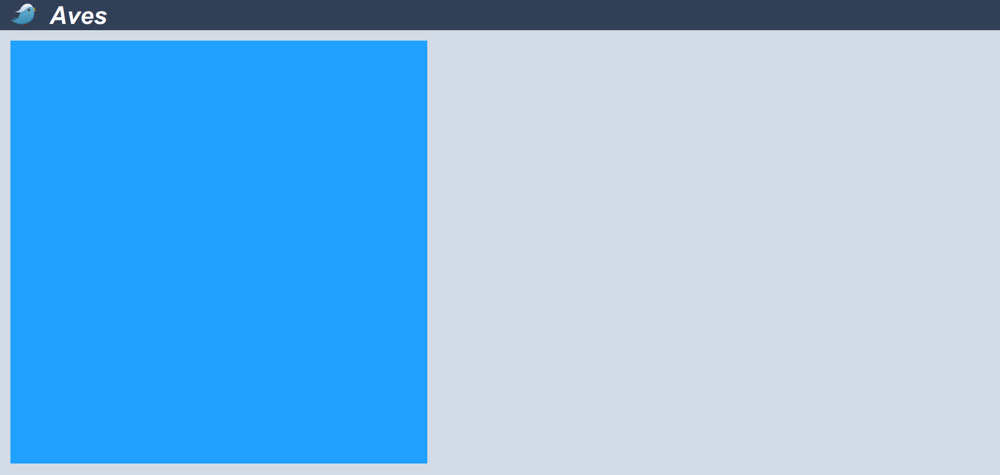
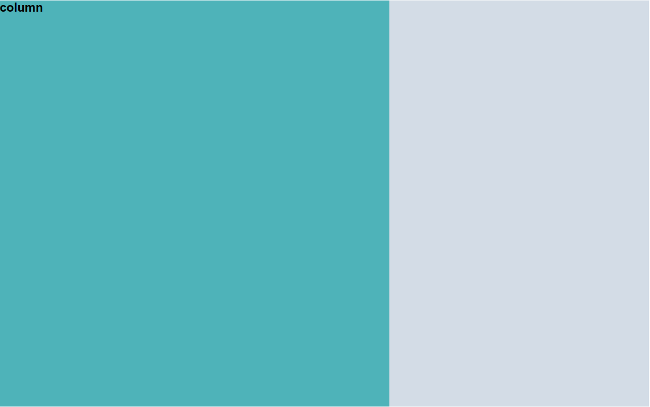
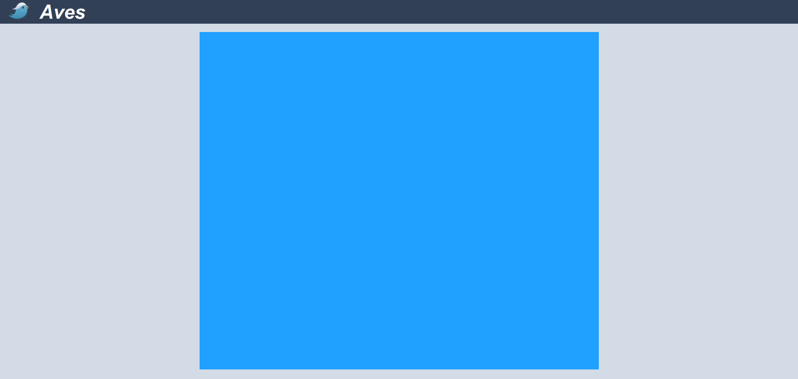
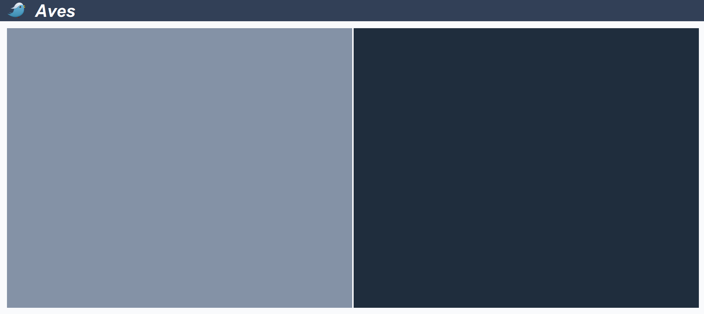

层叠样式表（**CSS**，*Cascading Stylesheet*）用于指定浏览器所渲染的样式（*如颜色、定位、装饰*），距离2011年CSS2.1版本发布至今，已经整整过去**6**个年头，浏览器和前端技术经历了日新月异的变化。虽然目前CSS3.0规范在选择器、弹性盒模型、动画与过渡方面进行了诸多增强，但是[W3C规范](https://www.w3.org/)始终保持着一致的继承性，所以CSS2.1及之前版本规范中提出的大量特性与概念依旧得以沿用。本文详细参考[Mozilla开发者社区](https://developer.mozilla.org/en-US/docs/Web/CSS)、[网易NEC](http://nec.netease.com/)前端开源项目、[CSS Mastery](https://www.apress.com/cn/book/9781430223979)，将CSS2.1当中常用的概念与典型布局进行了比较全面的梳理与概括。


<!-- more -->

## 层叠优先级

浏览器通过层叠样式表的优先级判断哪些CSS属性值与HTML元素最为相关，从而在该HTML元素上应用这些CSS属性值。当HTML元素同时拥有多个CSS声明时，每条CSS规则都会**接管**或者**覆盖**该元素从祖先元素继承而来的规则。

### 定义位置优先级

按照样式**声明与定义位置**的不同，优先级**由高向低**排列如下：

1. 行内样式：`<span style="">`
2. 内嵌样式表：`<style></style>`
3. 引入的外部样式表：`<link href="demo.css" rel="stylesheet" />`

### 选择器优先级

按照所使用**CSS选择器**的不同，优先级**由高向低**排列如下：

1. ID选择器（*例如`#example`*）
2. 类选择器（*例如`.example`*），属性选择器（*例如`[type="radio"]`*），伪类选择器（*例如`:hover`*）
3. 类型选择器（*例如`h1`*）和 伪元素（*例如`::before`*）

> 通用选择器（`*`）、组合选择器（*`+, >, ~, ' '`*）、否定伪类选择器（*`:not()`*）对特异性没有影响（*但`:not()`内声明的选择器会影响优先级*）。

### 样式继承

每个CSS属性值都会指明其是否可以继承，以便在没有手动为HTML元素指定样式值时，该元素默认应该使用哪个样式。

- 可继承CSS属性（*inherited property*）：未指定值时，取父元素同属性的计算值（*computed value*）。
- 非继承CSS属性（*reset property*）：未指定值时，取该属性的初始值（*initial value*）。

所有CSS属性都可以使用如下2个值：

1. `inherit`：让该CSS元素值去继承父元素同名CSS属性的计算值。
2. `initial`：将被父元素覆盖的属性值重置为该CSS属性的默认值。

### !important

使用`!important`规则的样式声明将会覆盖其它任何声明，如果两条带有`!important`规则的声明被应用到相同HTML元素上，拥有更高优先级的声明将会被采用。

```scss
background: red !important; 
```

> 不要在全站、插件当中使用`!important`，尽量只在局部页面需要覆写的情况下使用。


## 盒子模型

每个HTML元素都会被CSS描述为一个矩形的盒子，每个盒子模型都由`content`**内容**、`padding`**内边距**、`border`**边框**、`margin`**外边距**4个框所组成。


> `content`内容区域设置的背景、颜色、图片样式会延伸到`padding`区域。

## 可替换HTML元素

HTML可替换元素（*replaced element*）的渲染并不由**CSS**控制，某些情况下，CSS会对可替换元素做特殊处理，比如计算外边距和一些auto值。

```html
<!-- 典型可替换元素 -->
 <object/> <video/>
<!-- 表单元素 -->
<textarea/> <input/>
<!-- 特殊场景下表现为可替换元素 -->
<audio/> <canvas/>
```

> 通过CSS的`content`属性插入的HTML内容，被称为**匿名可替换元素**（*anonymous replaced elements*）。

## 简写属性

CSS规范定义简写属性的目的，在于将同一主题的常见属性定义集中在一起，从而编写更简洁、更具可读性的样式表。

```css
/* background */
#app {
  background-color: #000;
  background-image: url(images/bg.gif);
  background-repeat: no-repeat;
  background-position: top right;
}
#app {
  background: #000 url(images/bg.gif) no-repeat top right;
}

/* font */
#app {
  font-style: italic;
  font-weight: bold;
  font-size: .8em;
  line-height: 1.2;
  font-family: Arial, sans-serif;
}
#app {
  font: italic bold .8em/1.2 Arial, sans-serif;
}
```

目前CSS可以进行简写的属性如下：

- `flex`
- `list-style`
- `transition` `transform`,
- `background` `font` `margin` `padding`
- `border` `border-top` `border-right` `border-bottom` `border-left` `border-width` `border-color` `border-style` `border-radius`


## 块元素/行内元素


## 定位

### 相对定位

相对于HTML元素的原始位置（*普通文档流*）进行移动，HTML元素依然占据原来的空间，但可能会覆盖相临的HTML元素。

```css
#app {
  position: relative;
  top: 20px;
  right: 20px;
  bottom: 20px;
  left: 20px;
}
```

### 绝对定位

使HTML元素位置脱离文档流，其位置由已定位的父级元素确定，如果不存在这个已定位父级元素，则其位置是相对于初始包含块的（即`<html>`元素或viewport）。

```css
#app {
  position: absolute;
  top: 20px;
  right: 20px;
  bottom: 20px;
  left: 20px;
}
```

> 当绝对定位的HTML元素覆盖其它元素时，可以通过设置其`z-index`属性来控制堆放顺序。

### 浮动定位


## 外边距塌陷

margin塌陷（*margin collapsing*）是指HTML块元素的顶部margin和底部margin有时会被折叠为margin值最大的外边距，外边距塌陷通常出现在如下3种情况。

- 相邻的两个兄弟HTML元素之间的margin会塌陷。

```html
<p style="margin-bottom: 30px;">该段落的margin-bottom会被合并</p>
<p style="margin-top: 20px;">该段落的margin-top会被合并</p>
```

- 块级父元素与其第1个或最后1个子元素

- 空块元素

```html
<p style="margin-bottom: 0px;">这个段落的和下面段落的距离将为20px</p>
<div style="margin-top: 20px; margin-bottom: 20px;"></div>
<p style="margin-top: 0px;">这个段落的和上面段落的距离将为20px</p>
```

## 外边距负值


## 一列布局

```html
<main id="app">
  <div class="column">
    <h1>column</h1>
  </div>
</main>
```

### 一列定宽布局



```scss
#app {
  background: $gray;
  .column {
    background: $pink;
    width: 400px; // 宽度使用绝对单位
    height: 100%;
  }
}
```

### 一列宽度自适应



```html
<main id="app">
  <div class="column">
    <h2>column</h2>
  </div>
</main>
```
```scss
#app {
  background: $gray;
  .column {
    background: $pink;
    width: 60%;  // 宽度使用相对单位
    height: 100%;
  }
}
```

### 一列宽度居中



```html
<main id="app">
  <div class="column">
    <h2>column</h2>
  </div>
</main>
```
```scss
#app {
  background: $gray;
  .column {
    background: $pink;
    width: 60%;
    height: 100%;
    margin: 0 auto; // 块元素居中
  }
}
```

## 二列布局

```html
<main id="app">
  <div class="column-left">
    <h1>column-left</h1>
  </div>
  <div class="column-right">
    <h1>column-right</h1>
  </div>
</main>
```

### 二列定宽布局



```scss
#app {
  background: $gray;
  .column-left {
    background: $cyan;
    width: 300px;  // 绝对宽度
    height: 100%;
    float: left;
  }
  .column-right {
    background: $pink;
    width: 400px;  // 绝对宽度
    height: 100%;
    float: left;
  }
}
```


### 二列宽度自适应


```scss
#app {
  background: $gray;
  .column-left {
    background: $cyan;
    width: 30%;  // 相对宽度
    height: 100%;
    float: left;
  }
  .column-right {
    background: $pink;
    width: 60%;  // 相对宽度
    height: 100%;
    float: left;
  }
}
```


### 二列右侧宽度自适应


```scss
#app {
  background: $gray;
  .column-left {
    background: $cyan;
    width: 30%; // 左栏设置固定值
    height: 100%;
    float: left;
  }
  .column-right {
    background: $pink;
    height: 100%; 
    // 右栏不设置宽度和浮动
  }
}
```


### 二列左侧宽度自适应


```scss
#app {
  background: $gray;
  .column-left {
    background: $cyan;
    height: 100%;
    float: left;
    width: 100%;
  }
  .column-right {
    background: $pink;
    height: 100%;
    float: right;
    width: 30%;
    margin-left: -30%; // 负外边距
  }
}
```

>> `负外边距`和`不设置宽度和浮动`都可以用来分别实现**二列左右侧宽度自适应**效果。

## 三列布局

### 三列中间自适应布局


```html
<main id="app">
  <div class="column-left">
    <h1>column-left</h1>
  </div>
  <div class="column-middle">
    <div>
      <h1>column-middle</h1>
    </div>
  </div>
  <div class="column-right">
    <h1>column-right</h1>
  </div>
</main>
```
```scss
#app {
  background: $gray;
  .column-left {
    background: $cyan;
    height: 100%;
    position: relative;
    float: left;
    width: 350px;
    margin-right: -350px;  // 负外边距
  }
  .column-middle {
    background: $pink;
    height: 100%;
    float: left;
    width: 100%;
    // 嵌套div让出左右block的负值外边距
    div {
      margin-right: 300px;
      margin-left: 350px;
    }
  }
  .column-right {
    background: $blue;
    height: 100%;
    float: right;
    width: 300px;
    margin-left: -300px;  // 负外边距
  }
}
```

### 三列左侧自适应布局


```html
<main id="app">
  <div class="column-left">
    <div>
      <h1>column-left</h1>
    </div>
  </div>
  <div class="column-right">
    <h1>column-right</h1>
  </div>
  <!-- 居中内容因为浮动必须放置在DOM结构的最后 -->
  <div class="column-middle">
    <h1>column-middle</h1>
  </div>
</main>
```
```scss
#app {
  background: $gray;
  .column-left {
    background: $pink;
    height: 100%;
    float: left;
    width: 100%;
    margin-right: -650px;  // 设置外边距为负值
    div {
      margin-right: 650px;  // 补偿负值外边距
    }
  }
  .column-middle {
    background: $cyan;
    height: 100%;
    float: right;
    width: 350px;
  }
  .column-right {
    background: $blue;
    height: 100%;
    float: right;
    width: 300px;
  }
}
```

### 三列右侧自适应布局


```html
<main id="app">
  <div class="column-left">
    <h1>column-left</h1>
  </div>
  <div class="column-middle">
    <h1>column-middle</h1>
  </div>
  <div class="column-right">
    <div>
      <h1>column-right</h1>
    </div>
  </div>
</main>
```

```scss
#app {
  background: $gray;
  .column-left {
    background: $blue;
    height: 100%;
    width: 300px;
    position: relative; // 将块元素设置为相对定位
    float: left;
  }
  .column-middle {
    background: $cyan;
    height: 100%;
    width: 350px;
    position: relative; // 将块元素设置为相对定位
    float: left;
  }
  .column-right {
    background: $pink;
    float: right;
    height: 100%;
    width: 100%;
    margin-left: -650px; // 设置外边距为负值
    div {
      margin-left: 650px; // 补偿负值外边距
    }
  }
}
```


## 圣杯布局

[圣杯布局](https://alistapart.com/article/holygrail)


## 双飞翼布局


## 垂直居中


## 响应式栅格


## CSS精灵
