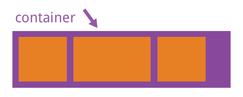
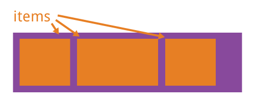

阅读W3C工作组成员[Lea Verou](https://github.com/LeaVerou)的《CSS揭秘》之后，开始重新审视重度交互下CSS3提供的各种最新特性，于是参考Mozilla的[CSS Reference](https://developer.mozilla.org/en-US/docs/Web/CSS/Reference)并结合[W3C规范](https://www.w3.org)对常用CSS3特性进行了归纳和总结。因为CSS2.1以后的规范越来越庞大，所以W3C工作组将这些规范打散到不同模块当中，每个模块都独立进行版本更新，所有CSS2.1已有特性模块都被升级到以*3*作为版本号，如果是全新的功能模块则版本号从*1*开始。因此，CSS3并非真正意义上的W3C规范，准确的描述应为**CSS标准规范第3版与部分版本号为1的新规范的集合**。目前CSS各模块版本的更新速度不尽相同，因此后续很难再给予准确的版本号描述。


<!-- more -->

> 一直以来，浏览器都通过前缀来区分那些最新的、具有实验性质的CSS3属性，例如Firefox（*-moz-*）、IE（*-ms-*）、Opera（*-o-*）、Safari和Chrome（*-webkit-*），但是这样并不利于规范的升级与统一，因此后续的新版浏览器正在逐步放弃这种做法，改为通过配置开关来启用这些实验性属性的支持。

## box-sizing

CSS中设置HTML元素的`width`与`height`只会作用在该元素的**内容区**，盒子模型的宽高会叠加`border`、`padding`的值，因此调整宽高度的时候需要时刻注意该HTML元素的`border`、`padding`，该特性在实现响应式布局时显得相当烦琐，而`box-sizing`属性正是用来调整这一行为的。

```css
.block {
  box-sizing: content-box;
  box-sizing: border-box;
}
```


1. `content-box`：默认值，宽度和高度都不包含内容的`border`和`padding`。
```javascript
width  = "内容的宽度"
height = "内容的高度"
```
2. `border-box`：盒子模型的宽、高度都会包含`border`和`padding`。
```javascript
width  = "border + padding + 内容区width"
height = "border + padding + 内容区height"
```


## flex

最近的W3C草案称为**Flexbox Layout**（笔者文章中统一翻译为**伸缩布局**），主要用于更有效的排列、布局、分配container中items之间的空间，即使是在这些元素尺寸未知或者动态的时候。Flex伸缩布局的主要思想，是让container具体改变其中items宽度、高度、顺序的能力，从而更优雅的填充可利用空间，并在它们缩小时防止overflow发生。





> Flex非常适用于组件级别、小粒度的页面布局，更大粒度的布局可以考虑使用Grid。

### container的属性

#### display

定义一个flex container，可以设置行内或者块级元素，可以让其直接子元素进入flex上下文。

```css
.container {
  display: flex; /* or inline-flex */
}
```

#### flex-direction


#### flex-wrap


#### flex-flow

#### justify-content


#### align-items


#### align-content


### items的属性

#### order

#### flex-grow

#### flex-shrink

#### flex-basis

#### flex

#### align-self


## grid

## transition

## animation

