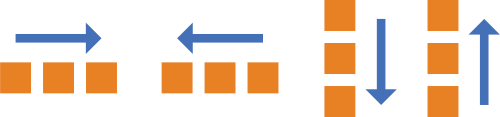
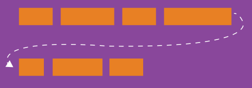
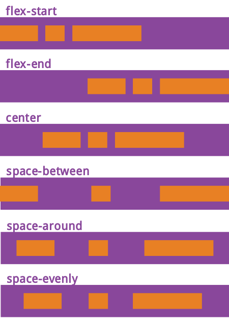
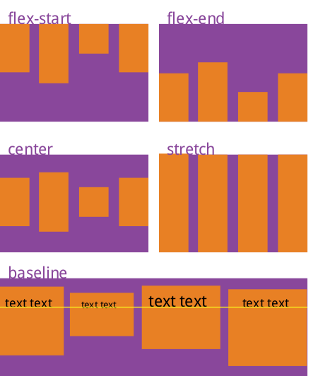
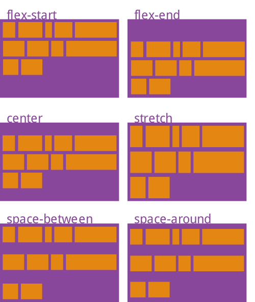

阅读W3C工作组成员[Lea Verou](https://github.com/LeaVerou)的《CSS揭秘》之后，开始重新审视重度交互下CSS3提供的各种最新特性，于是参考Mozilla的[CSS Reference](https://developer.mozilla.org/en-US/docs/Web/CSS/Reference)并结合[W3C规范](https://www.w3.org)对常用CSS3特性进行了归纳和总结。因为CSS2.1以后的规范越来越庞大，所以W3C工作组将这些规范打散到不同模块当中，每个模块都独立进行版本更新，所有CSS2.1已有特性模块都被升级到以*3*作为版本号，如果是全新的功能模块则版本号从*1*开始。因此，CSS3并非真正意义上的W3C规范，准确的描述应为**CSS标准规范第3版与部分版本号为1的新规范的集合**。目前CSS各模块版本的更新速度不尽相同，因此后续很难再给予准确的版本号描述。


<!-- more -->

> 一直以来，浏览器都通过前缀来区分那些最新的、具有实验性质的CSS3属性，例如Firefox（*-moz-*）、IE（*-ms-*）、Opera（*-o-*）、Safari和Chrome（*-webkit-*），但是这样并不利于规范的升级与统一，因此后续的新版浏览器正在逐步放弃这种做法，改为通过配置开关来启用这些实验性属性的支持。

## box-sizing

CSS中设置HTML元素的`width`与`height`只会作用在该元素的**内容区**，盒子模型的宽高会叠加`border`、`padding`的值，因此调整宽高度的时候需要时刻注意该HTML元素的`border`、`padding`，该特性在实现响应式布局时显得相当烦琐，而`box-sizing`属性正是用来调整这一行为的。

```css
.block {
  box-sizing: content-box;
  box-sizing: border-box;
}
```


1. `content-box`：默认值，宽度和高度都不包含内容的`border`和`padding`。
```javascript
width  = "内容的宽度"
height = "内容的高度"
```
2. `border-box`：盒子模型的宽、高度都会包含`border`和`padding`。
```javascript
width  = "border + padding + 内容区width"
height = "border + padding + 内容区height"
```


## flex

本段内容翻译自**CSS Tricks**社区的[《A Complete Guide to Flexbox》](https://css-tricks.com/snippets/css/a-guide-to-flexbox/)一文，Flex在最近的最近的W3C草案称为**Flexbox Layout**（笔者文章中统一翻译为**伸缩盒布局**），主要用于更有效的排列、布局、分配container中items之间的空间，即使是在这些元素尺寸未知或者动态的时候。Flex伸缩布局的主要思想，是让container具体改变其中items宽度、高度、顺序的能力，从而更优雅的填充可利用空间，并在它们缩小时防止overflow发生。


> Flex非常适用于组件级别、小粒度的页面布局，更大粒度的布局可以考虑使用Grid。

### container的属性

#### display

定义一个flex container，可以设置行内或者块级元素，设置之后其直接子元素将会纳入flex上下文。

```css
.container {
  display: flex; /* or inline-flex */
}
```

#### flex-direction

定义items在container中的排列方向，可以是**垂直**或者**水平**的方向。



```css
.container {
  flex-direction: row | row-reverse | column | column-reverse;
}
```

1. `row (默认)`: 在*ltr*环境下从**左**到**右**，*rtl*当中从**右**至**左**进行排列。 
2. `row-reverse`: 在*ltr*环境下从**右**到**左**，*rtl*当中从**左**至**右**进行排列。
3. `column`: 作用与`row`属性值类似，但是方向为从**上**至**下**。
4. `column-reverse`: 作用与`row-reverse`属性值类似，但是方向为从**下**至**上**。

#### flex-wrap

默认情况下，items总是会试图填充一行，但是可以通过这个属性去调整这一行为，让items根据需要进行换行。



```css
.container{
  flex-wrap: nowrap | wrap | wrap-reverse;
}
```

`nowrap` (默认): 所有items将会位于同一行当中。
`wrap`: items将会从**上**至**下**进行换行。
`wrap-reverse`: items将会从**下**至**上**进行换行。

#### flex-flow

该属性是`flex-direction`和`flex-wrap`的简写，用来定义container的**main axes**和**cross axes**，其默认值为`row nowrap`。

```css
flex-flow: <‘flex-direction’> || <‘flex-wrap’>
```

#### justify-content

英文justify有对齐的意思，即沿着main axis进行对齐。主要用于items不能伸缩时，分配空余的container空间；或是items能够伸缩，但是已经达到最大尺寸的场景。因此，该属性会在一行中的items发生溢出时影响其在container中的对齐方式。

```css
.container {
  justify-content: flex-start | flex-end | center | space-between | space-around | space-evenly;
}
```



`flex-start (默认)`: items被放置到每行开始的位置。
`flex-end`: items会被放置到每行结束的位置。
`center`: items会在该行居中放置。
`space-between`: items规则分布在一行当中，第1个item位于行的**开始**位置，最后1个item位于行**结束**的位置。
`space-around`: 所有items两侧都拥有相同的间距，因此视觉上的间距并不相等。第1个item将会依靠container边缘保持**1个单元**的距离，但接下来的item两侧都拥有着自己的空间，这样会导致出现**2个单元**的间距。
`space-evenly`: 所以items**平均分布**在一行，每个item的间隔距离视觉上**完全相等**。

#### align-items

该属性用于定义当前行中的items如何基于**cross axis**进行布局，功能与**main axis**上的`justify-content`属性类似。

```
.container {
  align-items: flex-start | flex-end | center | baseline | stretch;
}
```



`stretch (默认)`: 填充父容器，`stretch [stretʃ] n.伸展`（仍然需要考虑到`min-width`/`max-width`）。
`flex-start`: items的起始位置位于该行cross axis的**顶部**。
`flex-end`: items的起始位置位于该行cross axis的**底部**。
`center`: items位于该行cross axis的**居中位置**。
`baseline`: items基于它们**基线**的位置进行排列。

#### align-content

该属性用于设置当cross-axis拥有额外空间时，如何去排列container的行。类似于`justify-content`在main axis内如何排列每个**单独**的items行，因此当仅存在一个items行的时候，该属性并不会体现任何效果。

```css
.container {
  align-content: flex-start | flex-end | center | space-between | space-around | stretch;
}
```



`stretch (默认)`: container中的**行**伸缩并且占据剩余的空间。
`flex-start`: container中的行放置在容器**起始**的位置。
`flex-end`: container中的行放置在容器**结束**的位置。
`center`: 容器里的行在container中处于**居中**位置。
`space-between`: 第1行位于container起始的位置，最后1行位于container最后的位置，接下来**中间的行**进行平均分布。
`space-around`: 每行都以**相同的间隔距离**均匀分布。

### items的属性

#### order

items默认按照HTML源代码的先后顺序排列，但是可以通过items的`order`属性来控制其在container中的顺序。


```css
.item {
  order: <integer>; /* default is 0 */
}
```

#### flex-grow

用来定义items在container中**弹性伸展**的比例，其属性值为**没有单位的比例值**，从而规定每个item所应该占据的空间。如果所有item的`flex-grow`设置为**1**，那么每个item将会均匀的占据container中剩余的空间。如果其中某个item的`flex-grow`设置为**2**，则将会占据其它item两倍的空间。


```css
.item {
  flex-grow: <number>; /* default 0 */
}
```

> `flex-grow`的属性值不能是**负数**，否则将会被认为是一个无效值。


#### flex-shrink

该属性用来设置item**弹性收缩**时的比例，属性值依然为**没有单位的比例值**（`shrink [ʃrɪŋk] n.收缩`）。

```css
.item {
  flex-shrink: <number>; /* default 1 */
}
```

> `flex-shrink`的属性值同样不能为**负数**，否则会被认为无效。

#### flex-basis

设置不伸缩的情况下items的原始默认尺寸，其属性值可以是**长度值**或者**关键字**。

- `length`：单位数值，例如`20%`、`5rem`、`px`、`mm`、`pt`。
- `auto`：基于items自身的高度和宽度属性。
- `content`：根据items的内容自动调整大小尺寸，该主流浏览器对该关键字的支持还不太友好，因此包括类似的`max-content`, `min-content`, `fit-content`属性值较少被使用。

```css
.item {
  flex-basis: <length> | auto; /* default auto */
}
```

> `flex-basis`属性值如果设置为`0`，items内部内容以外的区域将不会被考虑。但如果设置为`auto`，剩余空间将基于`flex-grow`进行分配。


#### flex

该属性是`flex-grow`, `flex-shrink`, `flex-basis`属性的简写，该属性值第2个参数（*flex-shrink*）、第3个参数（*flex-basis*）是可选的，默认值为`0 1 auto`。

```css
.item {
  flex: none | [ <'flex-grow'> <'flex-shrink'>? || <'flex-basis'> ]
}
```

> 推荐使用该简写属性来简化items的设置。

#### align-self

items上的这个属性会覆写container上`align-items`属性的设置。

```css
.item {
  align-self: auto | flex-start | flex-end | center | baseline | stretch;
}
```


> 注意，item上的`float`, `clear`, `vertical-align`属性不会对flex布局造成影响。

### Flex布局思维导图


## grid


## transition

CSS3中提供的transition特性，提供了CSS属性变化时控制动画速度的方式，代替了CSS属性发生变化时立刻进行渲染的特性。transition能够决定哪个CSS属性体现过渡效果（*transition-property*），过渡效果何时开始发生（*transition-delay*），过渡期会持续多久（*transition-duration*），过渡效果将会如何体现（*transition-timing-function*）。transition属性结合CSS伪类选择器进行使用，可以实现非常良好的用户体验。

### transition-property

指定需要应用过渡效果的CSS属性的名称。

- `all`：所有能使用过渡的CSS属性全部有效。
- `none`：没有CSS属性会产生过渡效果。
- [可以使用过渡的CSS属性](https://developer.mozilla.org/en-US/docs/Web/CSS/CSS_animated_properties)：指定需要产生过渡效果的CSS属性。

```css
transition-property: none;
transition-property: all;
transition-property: all, weight, height;
```

### transition-duration

指定过渡动画持续的秒数或者毫秒数，默认值为`0s`，表明不会发生过渡效果。该属性可以同时指定多个持续时间值，这些时间会依次应用到`transition-property`上声明的属性。

```css
transition-duration: 6s;
transition-duration: 120ms;
transition-duration: 1s, 15s;
transition-duration: 10s, 30s, 230ms;
```

### transition-timing-function

描述CSS属性需要体现的过渡效果，通过建立一个加速曲线让过渡效果贯穿于`transition-duration`定义的持续时间，这些加速曲线使用[timing-function](https://developer.mozilla.org/en-US/docs/Web/CSS/single-transition-timing-function)进行定义。该属性同样可以一次指定多个timing-function，这些效果会在`transition-property`上依次应用。

```css
/* Keyword values */
transition-timing-function: ease;
transition-timing-function: ease-in;
transition-timing-function: ease-out;
transition-timing-function: ease-in-out;
transition-timing-function: step-start;
transition-timing-function: step-end;
transition-timing-function: linear;

/* Function values */
transition-timing-function: frames(10);
transition-timing-function: steps(4, end);
transition-timing-function: cubic-bezier(0.1, 0.7, 1.0, 0.1);

/* Multiple timing functions */
transition-timing-function: ease, step-start, cubic-bezier(0.1, 0.7, 1.0, 0.1);
```

### transition-delay

描述过渡效果的延迟等待时间，属性值为`0s`或`0ms`时表明过渡立即执行，为正值时会延迟过渡的执行时间，负值则会让过渡立刻开始（*但是可能会从中间状态开始*）。该属性依然可以指定多个延迟时间，这些时间会依次应用到`transition-property`上声明的属性。

```css
transition-delay: 3s;
transition-delay: 2s, 4ms;
```

### transition

该属性是`transition-property`, `transition-duration`, `transition-timing-function`, `transition-delay`的简写属性，可以快捷的定义HTML元素2种状态之间的转换，并结合CSS伪类选择器（例如`:hover`和`:active`）共同定义交互的过渡状态，或使用JavaScript动态的进行设置。

```css
/* Order for complete property  */
transition: <property> <duration> <timing-function> <delay>;

/* Apply to 1 property */
/* property name | duration */
transition: margin-right 4s;

/* property name | duration | delay */
transition: margin-right 4s 1s;

/* property name | duration | timing function */
transition: margin-right 4s ease-in-out;

/* property name | duration | timing function | delay */
transition: margin-right 4s ease-in-out 1s;

/* Apply to 2 properties */
transition: margin-right 4s, color 1s;

/* Apply to all changed properties */
transition: all 0.5s ease-out;
```

## animation

CSS动画由2部分组成，CSS动画的**样式描述**，以及标识动画开始、结束以及中间状态的**关键帧**（*keyframe*）。CSS动画比JavaScript控制的动画性能更加优异，浏览器执行更加平顺。

### animation-delay

定义动画执行的延迟时间，单位是秒（*s*）或毫秒（*ms*），可以设置为未来的某个时间点（*正值*），或者立即开始执行（*属性值为0*），或者从动画生命周期的中途执行（*负值*）。

```css
/* Single animation */
animation-delay: 3s;
animation-delay: 0s;
animation-delay: -1500ms;

/* Multiple animations */
animation-delay: 2.1s, 480ms;
```

### animation-direction

定义动画的播放方式，可以是向前、向后，或者前后交替播放。

- `normal`：正常向前播放。
- `reverse`：反方向播放。
- `alternate`：先正常再反向播放，并持续交替执行。
- `alternate-reverse`：先反向再正常播放，并持续交替执行。

```css
/* Single animation */
animation-direction: normal;
animation-direction: reverse;
animation-direction: alternate;
animation-direction: alternate-reverse;

/* Multiple animations */
animation-direction: normal, reverse;
animation-direction: alternate, reverse, normal;
```

### animation-duration

定义完成一个动画周期所需要的时间，值可以为**正数**或**零**，单位是秒（*m*）或毫秒（*ms*）。默认值为**零**，表示没有动画发生。

```css
/* Single animation */
animation-duration: 6s;
animation-duration: 120ms;

/* Multiple animations */
animation-duration: 1.64s, 15.22s;
animation-duration: 10s, 35s, 230ms;
```

### animation-fill-mode

设置目标HTML元素在动画周期之外所呈现的状态。

- `none`：默认值，**不设置**动画之外的状态。
- `forwards`：设置为动画**结束**时的状态。
- `backwards`：设置为动画**开始**时的状态。
- `both`：遵循动画**向前**、**向后**的规则，设置为动画**结束**或**开始**的状态。

```css
/* Single animation */
animation-fill-mode: none;
animation-fill-mode: forwards;
animation-fill-mode: backwards;
animation-fill-mode: both;

/* Multiple animations */
animation-fill-mode: none, backwards;
animation-fill-mode: both, forwards, none;
```

### animation-iteration-count

设置动画周期在结束之前所需要播放的**次数**，可以指定为多个值。

- `infinite`：无限循环。
- `<number>`：动画周期的重复播放次数，默认值为**1**，设置为小数会只播放动画周期的一部分。

```css
animation-iteration-count: 3;
animation-iteration-count: 2.3;
animation-iteration-count: infinite;
animation-iteration-count: 2, 0, infinite;
```

### animation-name

指定需要应用到HTML元素上的一个或多个动画名称，每个动画名称都会通过一个`@keyframes`规则进行定义。

- `none`：表示不指定任何关键帧动画。
- `<custom-ident>`：指定关键帧动画的名称，对大小写敏感，可以由`字母`、`数字`、`_`或`-`组成。

```css
/* Single animation */
animation-name: none;
animation-name: test_05;
animation-name: -specific;
animation-name: sliding-vertically;

/* Multiple animations */
animation-name: test1, animation4;
animation-name: none, -moz-specific, sliding;
```

### animation-play-state

用于指定动画的运行和停止，可以通过JavaScript设置该属性的值，进而实现对动画播放的控制。

- `running`：播放动画。
- `paused`：暂停播放，恢复时会从暂停的位置开始，而非重新开始一个动画周期。

```css
/* Single animation */
animation-play-state: running;
animation-play-state: paused;

/* Multiple animations */
animation-play-state: paused, running, running;
```

### animation-timing-function

动画的**时序函数**通过三次贝塞尔数学函数（*Cubic Bezier*）来生成速度曲线。

- `cubic-bezier(<number>, <number>, <number>, <number>)`：指定贝塞尔曲线类型，4个参数都需要在`[0, 1]`区间范围内。
- `linear`：线性过渡，等同贝塞尔曲线`(0.0, 0.0, 1.0, 1.0)`。
- `ease`：平滑过渡，等同贝塞尔曲线`(0.25, 0.1, 0.25, 1.0)`。
- `ease-in`：由慢到快，等同贝塞尔曲线`(0.42, 0, 1.0, 1.0)`。
- `ease-out`：由快到慢，等同贝塞尔曲线`(0, 0, 0.58, 1.0)`。
- `ease-in-out`：由慢到快再到慢，等同贝塞尔曲线`(0.42, 0, 0.58, 1.0)`。
- `steps(<integer>[, [ start | end ] ]?)`：接受2个参数的步进函数。第1个参数是指定**函数步进数**的正整数，第2个参数可选，用于指定每一步值发生变化的时间点，可以为`start`或`end`（*默认值*）关键字。
- `step-start`：等同于`steps(1, start)`。
- `step-end`：等同于`steps(1, end)`。

```css
/* Keyword values */
animation-timing-function: ease;
animation-timing-function: ease-in;
animation-timing-function: ease-out;
animation-timing-function: ease-in-out;
animation-timing-function: linear;
animation-timing-function: step-start;
animation-timing-function: step-end;

/* Function values */
animation-timing-function: cubic-bezier(0.1, 0.7, 1.0, 0.1);
animation-timing-function: steps(4, end);
animation-timing-function: frames(10);

/* Multiple animations */
animation-timing-function: ease, step-start, cubic-bezier(0.1, 0.7, 1.0, 0.1);
```

### animation

动画的快捷属性，其默认值列表如下所示：

- `animation-name: none`
- `animation-duration: 0s`
- `animation-timing-function: ease`
- `animation-delay: 0s`
- `animation-iteration-count: 1`
- `animation-direction: normal`
- `animation-fill-mode: none`
- `animation-play-state: running`

```css
/* @keyframes duration | timing-function | delay | iteration-count | direction | fill-mode | play-state | name */
animation: 3s ease-in 1s 2 reverse both paused slidein;

/* @keyframes duration | timing-function | delay | name */
animation: 3s linear 1s slidein;

/* @keyframes duration | name */
animation: 3s slidein;

@keyframes slidein {
  from { transform: scaleX(0); }
  to   { transform: scaleX(1); }
}
```


## @keyframes

通过为关键帧或者基准点定义样式，来控制动画序列的中间步骤，相比于`transitions`过渡，animation能够提供更为丰富的设置。`@keyframes`定义的名称需要添加至`animation-name`属性上，每个`@keyframes`规则都包含了一组关键帧选择器的列表，这些选择器设置了动画周期上指定时间百分比的样式，即定义每一个关键帧所呈现的样式。

`from`：起始于动画序列时间`0%`的**开始**偏移量。
`to`：起始于动画序列时间`100%`的**结束**偏移量。
`<percentage>`：动画序列时间的具体**百分比**。

```css
@keyframes tofrom {
  from { opacity: 1; }
  to { opacity: 0; }
}

@keyframes percentage {
  from { transform: translate(0, 0); }
  20% { transform: translate(20px, 20px); }
  40% { transform: translate(40px, 0); }
  60% { transform: translate(60px, 20); }
  80% { transform: translate(80px, 0); }
  to { transform: translate(100px, 20px); }
}
```

> `@keyframes`规则不会级联，浏览器总是执行最后定义的关键帧。

> 声明在关键帧中的`!important`属性将会被忽略。

## @media

## transform
