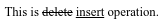
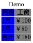
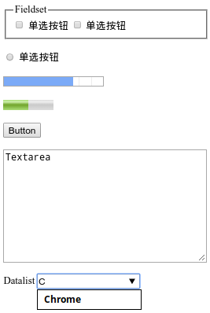

本篇文章翻译自mozilla的官方文档[HTML Reference](https://developer.mozilla.org/en-US/docs/Web/HTML/Element)，包含了**HTML5**新增的标签元素，方便大家快速的定位自己所需的HTML标签，书写更加优雅的语义化DOM结构。本文内所涉及的HTML元素都经过[CANIUSE](https://caniuse.com)进行了兼容性比对，比注明了当前的兼容性状况。


<!-- more -->

## 元素 

### 根级元素

| 元素 | 语义 |
|:-----|:-----|
| `<html>` | 一个HTML文档的根元素，所有其它HTML元素必须是其后代。 |
| `<head>`  | 定义文档相关的元数据信息，包括标题、样式、脚本等。 |
| `<body>` | 展现HTML文档的内容区域，一个文档只能拥有一个`<body>`元素。 |

### 元数据

包含页面相关的信息，可以辅助搜索引擎和浏览器引用或渲染页面。

| 元素 | 语义 |
|:-----|:-----|
| `<base>`  | 指定文档中所有URL的基地址，一份文档只能拥有一个`<base>`元素。 |
| `<link>`  | 指定外部资源与文档的关系，可以为导航定义关系框架，但通常用来链接CSS文件。 |
| `<meta>`  | 表达那些不能由其它元数据标签表达的信息。 |
| `<style>` | 包含文档的CSS样式信息。 |
| `<title>` | 定义文档的标题，显示在浏览器的标题栏或标签页上。 |

### 内容分区

用来将文档内容进行逻辑上的组织与划分，为页面内容创建清晰明确的大纲与分区。

| 元素 | 语义 |
|:-----|:-----|
| `<nav>`     | 描述含有多个超级链接、链接列表的区域。 |
| `<article>` | 表示页面当中的独立结构，即可独立分配和复用的结构。可以是文章、用户评论、交互式组件等独立的项目内容。 |
| `<section>` | 表示HTML文档中的一个独立的功能性章节，该元素内通常会包含`<h1>-<h6>`子节点，可以通过`<article>`组合多个`<section>`的内容。 |
| `<aside>`   | 表达一个与其它页面内容无关的独立部分，可以被单独拆分且不会影响整体。通常表现为侧边栏、嵌入内容、广告、web应用程序、个人资料信息、博客链接等。 |
| `<footer>`  | 表示最近的章节内容、根节点元素的页脚，通常包含有作者、版权、文档相关链接等信息。 |
| `<h1–h6>`   | 用来体现**6**个层级的段落标题，其中`<h1>`级别最高，`<h6>`级别最低，|
| `<header>`  | 一组介绍性信息，可能包含标题元素，也可以包含logo、搜索表单等信息。 |
| `<hgroup>`  | 代表一个文档片段的多层次标题信息，即对`<h1>`-`<h6>`进行分组。 |
| `<address>` | 为距离该标签最近的`<article>`或`<body>`祖先元素提供联系信息。 |

### 文本内容

用来组织`<body>`标签内区块、章节的内容，并标识出这些内容的宗旨与结构，这对于**accessibility**（*可访问性*）和**SEO**（*搜索引擎优化*）非常重要。

| 元素 | 语义 |
|:-----|:-----|
| `<blockquote>` | 表达HTML元素的引用内容，渲染时会有缩进。引用来源可以通过该元素的`cite`属性进行标注`<blockquote cite='https://uinika.github.io/'>`；如果要以文本形式体现引文出处，则可以直接通过`<cite>`元素。 |
| `<dl>`         | 定义一个描述性的列表，通常用于展示词汇表、元数据、键值对列表。 |
| `<dd>`         | 代表描述性列表`<dl>`当中的1项描述，该元素只能作为`<dt>`的子元素出现。 |
| `<dt>`         | 代表描述性列表`<dl>`当中的1个术语，该元素只能作为`<dt>`子元素出现，该元素后面通常会跟随`<dd>`，多个连续出现的`<dt>`由出现在其后面的第1个`<dd>`定义。 |
| `<div>`        | 通用的文档流内容容器，语义上不代表任何特定类型内容，可以用来对其它元素进行分组，一般用于样式化相关的需求，只出现没有其它语义元素可用的场景下 。 |
| `<figure>`     | 一段独立的内容，通常需要嵌套`<figcaption>`使用，用于对引用的插图、表格、代码段进行说明。 |
| `<figcaption>` | 用于在`<figure>`元素内添加插图、表格、代码段的说明信息 |
| `<hr>`         | 表示两个段落元素之间的主题转折，通常被渲染为一条水平线。 |
| `<li>`         | 表示列表里的条目，可以被包含在`<ol>`、`<ul>`、`<menu>`内部。 |
| `<ul>`         | 表示无序列表，即列表中项目的顺序是无意义的。 |
| `<ol>`         | 表示有序列表，渲染结果会带有序数编号。 |
| `<main>`       | 用于呈现文档`<body>`中的主体内容，一个文档只能使用一个`<main>`元素，且不应该放置主体内容之外的侧边栏、导航栏、搜索栏、版权信息、网站logo等信息。</main> |
| `<p>`          | 表示一个文本段落，是一个典型的块级元素。 |
| `<pre>`        | 表示预定义格式文本，该元素中的文本会按照原文件中的格式编排，文本中的*空格*和*换行*都会原样呈现出来。 |

### 内联文本

用来定义字词、文本行片段等内联元素的语义和结构。

| 元素 | 语义 |
|:-----|:-----|
| <a>	用于创建指向其它地址的链接或锚元素。 |
| <abbr>	表示缩写，但是可以通过`title`属性提供完整的描述。 |
| <b>	加粗文本，体现与普通文本的区别，但并不表示**强调**，可以用来标注文章中的引言。 |
| <bdi>	使文本脱离其父元素的文本方向设置。 |
| <bdo>	按照`dir`属性改变**文字**的输出方向。 |
| <br> 在文本中产生一个换行效果。 |
| <cite> 表示文档中引用的内容。 |
| <code> 呈现一段计算机代码，默认显示为等宽字体。 |
| <data> 将一个指定内容和机器可读的翻译联系在一起。但如果内容是与 time 或者 date 相关的，一定要使用 <time>。 |
| <dfn> 表示一个术语的定义。 |
| <em> 标记出需要用户重点阅读的内容，可以嵌套使用，嵌套层级越深表示内容更加重点。 |
| <i> 斜体显示文本，用来与其它文本内容进行区分。 |
| <kbd> 表示用户输入，它将产生一个行内元素，以浏览器默认*monospace*字体显示。 |
| <mark> 需要进行突出显示的文字，例如显示搜索引擎的关键词。 |
| <q>	表示**行内**的引用文本，同样拥有一个`cite`属性，如果是**块级**的文本引用则需要使用`<blockquote>`替代。 |
| 
| <rp> 用于为那些不能使用 <ruby> 元素展示 ruby 注解的浏览器，提供随后的圆括号。 |
| <rt>	HTML <rt> element 包含字符的发音，字符在 ruby 注解中出现，它用于描述东亚字符的发音。这个元素始终在 <ruby> 元素中使用。 |
| <rtc>	HTML <rtc> 元素包含文字的语义注解，它们在 <rb> 元素中展示。<rb> 元素可以拥有发音 (<rt>) 和语义(<rtc>) 注解。 |
| <ruby>	HTML <ruby> 元素 被用来展示东亚文字注音或字符注释。 |
| <s>	HTML <s> 元素 使用删除线来渲染文本。使用 <s> 元素来表示不再相关，或者不再准确的事情。但是当表示文档编辑时，不提倡使用 <s> ；为此，提倡使用 <del> 和 <ins> 元素。 |
| <samp>	<samp> 元素用于标识计算机程序输出，通常使用浏览器缺省的 monotype 字体（例如 Lucida Console）。 |
| <small>	HTML 中的元素將使文本的字体变小一号。(例如从大变成中等，从中等变成小，从小变成超小)。在HTML5中，除了它的样式含义，这个元素被重新定义为表示边注释和附属细则，包括版权和法律文本。 |
| <span>	HTML <span> 元素是短语内容的通用行内容器，并没有任何特殊语义。可以使用它来编组元素以达到某种样式意图（通过使用类或者Id属性），或者这些元素有着共同的属性，比如lang。应该在没有其他合适的语义元素时才使用它。<span> 与 <div> 元素很相似，但<div> 是一个 块元素 而 <span> 则是 行内元素 . |
| <strong>	Strong 元素 (<strong>)表示文本十分重要，一般用粗体显示。 |
| <sub>	HTML <sub> 元素定义了一个文本区域，出于排版的原因，与主要的文本相比，应该展示得更低并且更小。 |
| <sup>	HTML <sup> 元素定义了一个文本区域，出于排版的原因，与主要的文本相比，应该展示得更高并且更小。 |
| <time>	HTML time 标签(<time>) 用来表示24小时制时间或者公历日期，若表示日期则也可包含时间和时区。 |
| <u>	HTML <u> 元素使文本在其内容的基线下的一行呈现下划线。在HTML5中, 此元素表示具有未标注的文本跨度，显示渲染，非文本注释，例如将文本标记为中文文本中的专有名称(一个正确的中文标记), 或 将文本标记为拼写错误。 |
| <var>	<var> 标签表示变量的名称，或者由用户提供的值。 |
| <wbr>	HTML <wbr> 元素  — 一个文本中的位置，其中浏览器可以选择来换行，虽然它的换行规则可能不会在这里换行。 |


### 图片和多媒体

HTML提供的对图片、音频、视频的支持。

| 元素 | 语义 |
|:-----|:-----|
| `<area>`  | 在图片上定义一个热点区域。 |
| `<video>` | 向文档中嵌入视频内容。 |
| `<audio>` | 向文档中嵌入音频内容，资源可以通过`src`属性或`<source>`元素进行描述。 |
| ``   | 描述文档中的一个图像。 |
| `<map>`   | 定义图片上可点击的链接区域，通常与`<area>`搭配使用。 |
| `<track>` | 用来指定计时字幕，需要作为媒体元素`<audio>`和`<video>`的子元素使用。 |

```html
<video src="foo.ogg">
  <track kind="subtitles" src="foo.en.vtt" srclang="en" label="English">
  <track kind="subtitles" src="foo.sv.vtt" srclang="cn" label="Chinese">
</video>

<audio src="foo.ogg">
  <track kind="captions" src="foo.en.vtt" srclang="en" label="English">
  <track kind="captions" src="foo.sv.vtt" srclang="cn" label="Chinese">
</audio>

<audio controls="controls">
  <source src="foo.wav" type="audio/wav">
</audio>

<map name="map-example">
  <area shape="circle" coords="200,250,25" href="another.htm" />
  <area shape="default" />
</map>


```

### 内嵌内容

HTML提供的常规多媒体之外的支持，但是这些支持并不容易交互。

| 元素 | 语义 |
|:-----|:-----|
| `<source>` | 用来定义`<picture>`、`<audio>`、`<video>`内的多媒体资源。 |
| `<embed>`  | 嵌入外部的交互式插件。 |
| `<object>` | 用于引入外部的插件资源。 |
| `<param>`  | 用来定义`<object>`的参数。 |

```html
<embed type="video/quicktime" src="movie.mov" width="250" height="220">

<video controls>
  <source src="video.webm" type="video/webm">
  <source src="video.ogg"  type="video/ogg"> 
  <source src="video.mov"  type="video/quicktime">
</video>

<object data="move.swf" type="application/x-shockwave-flash">
  <param name="foo" value="bar">
</object>
```

### 脚本

提供脚本语言（*例如JavaScript*）支持的HTML标签。

| 元素 | 语义 |
|:-----|:-----|
| `<canvas>`   | 用来通过JavaScript脚本绘制位图，。 |
| `<noscript>` | 如果不支持页面上的脚本类型，或者浏览器关闭了脚本支持，该元素定义了需要显示在html上的内容。 |
| `<script>`   | 用于嵌入或引用可执行脚本。 |

```html
<canvas id='bitmap'></canvas>

<script>
var canvas=document.getElementById('bitmap');
var ctx=canvas.getContext('2d');
ctx.fillStyle='#FF0000';
ctx.fillRect(8, 8, 100, 50);
</script>
```


### 编辑标识

两个HTML元素配合起来使用，用以标记文档中的更新与修正。

| 元素 | 语义 |
|:-----|:-----|
| `<del>` | 表示已经从文档中删除的文本，会渲染删除线。 |
| `<ins>` | 定义插入到文档中的文本。 |

```html
<!-- del内的错误文字应该被ins内的正确文字修正-->
This is <del>delete</del> <ins>insert</ins> operation.
```



### 表格内容

用于创建和展示表格。

| 元素 | 语义 |
|:-----|:-----|
| `<table>`    | 展现表格化数据，是所有表格相关元素的父元素。 |
| `<caption>`  | 表格的标题，常作为`<table>`的第1个子元素出现，并显示在表格内容的最前面。 |
| `<colgroup>` | 对表格的列进行组合，便于通过`<col>`设置属性并进行格式化。 |
| `<col>`      | 为表格的列定义各种属性值，只能用于`<colgroup>`内部。 |
| `<thead>`    | 定义表格的列头的行。 |
| `<tbody>`    | 表格的主体，用来放置`<tr>`元素 |
| `<tfoot>`    | 表格的尾部，通常用来表达汇总信息 |
| `<th>`       | 定义一列单元格的头部信息 |
| `<tr>`       | 定义表格中的行，可以用来放置`<td>`和`<th>`元素。 |
| `<td>`       | 定义表格中的单元格 |

```html
<table>

  <caption>Demo</caption>

  <colgroup>
    <col style="background-color: blue">
    <col style="background-color: gray">
  </colgroup>

  <thead>
    <tr>
      <th>月份</th>
      <th>工资</th>
    </tr>
  </thead>

  <tfoot>
    <tr>
      <td>合计</td>
      <td>￥180</td>
    </tr>
  </tfoot>

  <tbody>
    <tr>
      <td>1月</td>
      <td>￥100</td>
    </tr>
    <tr>
      <td>2月</td>
      <td>￥80</td>
    </tr>
  </tbody>

</table>
```



### 表单

用来创建用户交互表单的HTML元素。

| 元素 | 语义 |
|:-----|:-----|
| `<form>`     | 代表一个交互表单区域。 |
| `<button>`   | 表示一个按钮。|
| `<input>`    | 输入域，用来接收用户的输入。 |
| `<datalist>` | 定义`<input>`的可能的选项值，*目前仅**Safari**未提供该元素支持*。 |
| `<label>`    | 为输入域元素`<input>`定义标题。|
| `<fieldset>` | 用来对表单控件的内容进行分组。 |
| `<legend>`   | 为`<fieldset>`元素定义标题，***IE**不支持该元素*。 |
| `<textarea>` | 用来创建多行文本输入域。|
| `<select>`   | 用来创建单选/多选菜单。 |
| `<option>`   | 用来定义下拉列表元素`<select>`的一个选项。 |
| `<optgroup>` | 可以对`<select>`元素中的`<option>`进行分组。 |
| `<meter>`    | 用来显示已知范围的比例值，通常被渲染为柱状图。 |
| `<output>`   | 控制文本输出的API，***IE**不支持该元素*。 |
| `<progress>` | 用来展示完成进度，通常渲染为一个进度条，*已经获得包括**IE**在内的全部浏览器支持*。 |

```html
<form action="/server/api" method="post">
  <fieldset>
    <legend>Fieldset</legend>
    <input type="checkbox" name="check" id="check-A" value="A" />
    <label for="check-A">单选按钮</label>
    <input type="checkbox" name="check" id="check-B" value="B" />
    <label for="check-B">单选按钮</label>
  </fieldset>

  <input type="radio" id="radio">
  <label for="radio">单选按钮</label>

  <progress value="70" max="100">Progress</progress>

  <meter min="200" max="500" value="350">Meter</meter>

  <button name="button">Button</button>

  <select>
    <optgroup label="四川">
      <option value="chengdu">成都</option>
      <option value="mianyang">绵阳</option>
    </optgroup>
    <optgroup label="贵州">
      <option value="guiyang">贵阳</option>
      <option value="zunyi">遵义</option>
    </optgroup>
  </select>

  <textarea name="textarea" rows="10" cols="30">Textarea</textarea>

  <label>Datalist
    <input list="browsers">
  </label>
  <datalist id="browsers">
    <option value="Internet Explorer" />
    <option value="Chrome" />
    <option value="Firefox" />
    <option value="Opera" />
    <option value="Safari" />
  </datalist>
</form>
```



### 交互元素

用来帮助建立用户可交互的元素。

| 元素 | 语义 |
|:-----|:-----|
| `<dialog>`   | 展示对话框或其它交互组件，*仅Opera和Chrome支持*。 |
| `<details>`  | 定义查看和检索附加信息的小部件。 |
| `<summary>`  | 展示`<details>`元素的摘要或总结。|

```html
<details open>
  <summary>摘要</summary>
  <p>内容1</p>
  <p>内容2</p>
</details>

<dialog open>
  <p>Dialog</p>
</dialog>
```


### Web组件

用来建立用户自定义元素，（*[Web Component](https://www.w3.org/TR/components-intro/)目前还处于草案阶段，还未成为事实上的标准，且部分内容已经被废弃*）。

| 元素 | 语义 |
|:-----|:-----|
| `<slot>`     | 作为占位符，用来插入自定义的标记文本，*该元素目前还属于实验性技术*。 |
| `<template>` | ES6模板字面量，该元素中的内容在页面加载时不被渲染，但可以通过JavaScript实例化，*目前已经得到**IE**外的其它全部浏览器支持*。 |

### 废弃的元素

W3C的HTML规范声明放弃使用的元素。

| Deprecated | Deprecated | Deprecated | Deprecated | Deprecated | Deprecated |
|:-----|:-----|:-----|:-----|:-----|:-----|
|`<acronym>`  |`<applet>` |`<basefont>`|`<big>`     |`<blink>`    |`<center>` |
|`<dir>`      |`<font>`   |`<frame>`   |`<frameset>`|`<image>`    |`<isindex>`|
|`<keygen>`   |`<listing>`|`<marquee>` |`<multicol>`|`<nextid>`   |`<noembed>`|
|`<plaintext>`|`<spacer>` |`<strike>`  |`<tt>`      |`<xmp>`      |`<command>`|
|`<content>`  |`<element>`|`<shadow>`  |`<menu>`    |`<menuitem>` |`...`      |


## 属性


## 全局属性


## 链接类型