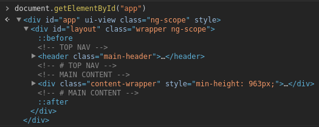
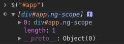

## JQuery对象和DOM对象

- DOM对象：通过原生javascript（如`getElementsByTagName`或`getElementId`）获取的html节点。

```javascript
var dom = document.getElementById("id") // 获取DOM对象
var html = dom.innerHTML; // 获取DOM元素内的HTML代码 
```



- JQuery对象：被jquery包装过的DOM对象

```javascript
var jq = $("#id"); // 获取JQuery对象
var html = jq.html(); // 获取JQuery对象内的HTML代码
```



> 不能交换使用JQuery对象、DOM对象上的属性，如上面代码中的`innerHTML`与`html()`。

<!-- more -->

## JQuery对象->DOM对象

JQuery提供了2种转换DOM对象的方法：

（1）JQuery对象是一个类似于数组的对象，因此可以通过数组运算符`[]`获取指定索引的DOM对象。

```javascript
var jq = $(".test"); // JQuery对象
var dom = jq[0];  // DOM对象
```

（2）通过JQuery本身提供的`get(index)`方法来获取指定index的对象。

```javascript
var jq = $(".test"); // JQuery对象
var dom = jq.get(0);  // DOM对象
```

## DOM对象->JQuery对象

将DOM对象通过`$()`函数包装起来，就可以获得JQuery对象。

```javascript
var dom = document.getElementById("test");
var jq = $(dom);
```

> 可以考虑使用**$**作为前缀为JQuery对象进行命名，例如上面代码中的变量`jq`可以命名为`$jq`。